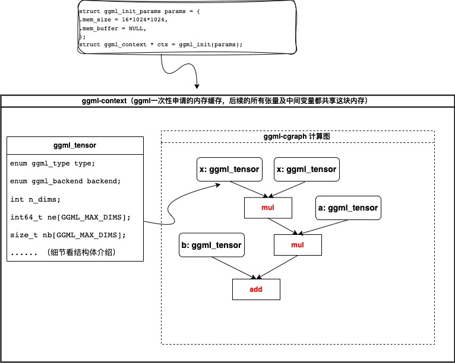

# ggml学习笔记（二）ggml.h源码解读
## 概念介绍

ggml.h 包含了一系列的计算图构建、张量的算子操作、自动微分、以及基础的优化算法。

1. **计算图（Computation Graph）**：计算图，也称为计算图或数据流图，是数学操作的表示，其中节点代表操作（例如加法、乘法）或函数，边代表这些操作之间的数据流动（张量或变量）。计算图用于定义和可视化复杂数学函数中的数据和操作流动。

2. **张量操作（Tensor Operations）**：张量操作是对张量执行的数学操作。张量是多维数组，可以表示各种类型的数据，如标量、向量、矩阵或更高维数组。张量操作可以包括加法、乘法、卷积和其他在机器学习和数值计算中常用的操作。

3. **函数定义（Function Definition）**：在你描述的上下文中，函数是使用计算图中的一系列张量操作来定义的。该函数表示一个数学模型，将输入数据（张量）映射到输出，并且可能会相当复杂，特别是在深度学习模型中。

4. **梯度（Gradient）**：计算函数相对于其输入变量的梯度对于优化和训练机器学习模型至关重要。梯度提供了关于函数的输出如何随其输入变化而变化的信息。它在优化算法（如梯度下降）中使用，以迭代方式更新模型参数并最小化损失函数。

5. **优化算法（Optimization Algorithms）**：优化算法用于调整函数的参数（例如神经网络权重），以最小化或最大化某个特定目标（例如最小化损失函数）。常见的优化算法包括梯度下降、Adam、RMSprop等。这些算法使用梯度信息以迭代方式更新参数，直到收敛。

6. **前向计算（Forward Computation）**：前向计算函数接受输入张量的值，并根据定义的张量操作计算输出张量的值。这是对输入执行一系列操作以获得输出的过程，通常是模型的正向传播。

7. **反向计算、反向传播（Backward Computation）**：反向计算函数接受输出张量的伴随值（也称为梯度）并计算输入张量的伴随值。这是为了计算函数相对于输入的梯度，通常是为了在优化过程中更新模型参数（例如使用反向传播算法）

8. **行优先储存（Row-Major Order）**：行优先是一种多维数组元素存储方式，其中数组的元素按照行的顺序存储在内存中。这意味着每一行的元素都相邻存储，而不同行之间的元素可能不相邻。

GGML将数学函数定义为计算图，在这些图中执行张量操作，计算函数值，计算梯度，并使用各种优化算法优化函数。这种库在机器学习和科学计算中非常基础，用于构建和训练模型。



## 官方案例


定义一个前向计算$f(x)=ax^2 + b$，下列代码定义了参数初始化的过程和前向计算过程。

```c
// 例如函数 f(x) = a*x^2 + b
// 其中 a，b为模型参数，x为模型输入变量
// 需要提前定义好需要的内存，
// 需要注意后续定义的张量的大小不能超过自定义的内存大小
// 可以使用ggml_used_mem()来查看当前实际使用的内存大小
struct ggml_init_params params = {
  .mem_size   = 16*1024*1024,
  .mem_buffer = NULL,
};

// 申请内存，初始化参数， ggml会一次性申请够内存量，
// 后续所有的计算开销缓存都会共享这块内存，
// 为了避免用户使用过程中内存泄露
struct ggml_context * ctx = ggml_init(params);
// 初始化输入x， x为输入变量
// ggml_new_tensor_1d创建一个1维的张量，
// 支持多维张量，ggml_new_tensor_1d、ggml_new_tensor_2d、ggml_new_tensor_3d、ggml_new_tensor_4d
// ggml_new_tensor_1d将在ggml_init申请的内存中申请一块存储空间
struct ggml_tensor * x = ggml_new_tensor_1d(ctx, GGML_TYPE_F32, 1);

// ggml_set_param函数用于标记当前的变量为输入变量， 
// 会在计算梯度和优化算法中使用到
ggml_set_param(ctx, x); 

// ggml_new_tensor_1d创建一个1维的张量， 在ctx中申请一块空间
struct ggml_tensor * a  = ggml_new_tensor_1d(ctx, GGML_TYPE_F32, 1);
struct ggml_tensor * b  = ggml_new_tensor_1d(ctx, GGML_TYPE_F32, 1);
// 所有的算子会返回一个新的张量，
// 并且每个算子都需要实现前向计算和后向传播（梯度计算）
struct ggml_tensor * x2 = ggml_mul(ctx, x, x);
struct ggml_tensor * f  = ggml_add(ctx, ggml_mul(ctx, a, x2), b);

```

​		上诉代码仅仅只是完成参数创建及定义，和计算图的定义，并没有进行前向计算。相当于建立模型但是还没有初始化参数。

​		ggml中的多维张量以行优先（row-major order）的方式存储。ggml_tensor 结构包含了每个维度中元素的数量（"ne"， 类似于tensor.size）以及字节数（"nb"，也叫做步幅）。这使得可以存储在内存中不是连续的张量，这对于诸如转置和排列等操作非常有用。所有的张量操作都必须考虑步幅，并且不应该假设张量在内存中是连续的。

​		接下来是初始化参数和前向推理代码， 其中ggml_graph_compute才是实际模型前向计算。

```c
//构建计算图
struct ggml_cgraph gf = ggml_build_forward(f);

// 设置x输入为浮点数2.0
ggml_set_f32(x, 2.0f);

// 初始化模型
// 初始化a参数为浮点数3.0
ggml_set_f32(a, 3.0f);
// 初始化b为浮点数4.0
ggml_set_f32(b, 4.0f);

// 前向计算
ggml_graph_compute_with_ctx(ctx, &gf, n_threads);

printf("f = %f\n", ggml_get_f32_1d(f, 0));
```


### 宏介绍

| 宏名                    | 宏说明                                 |
| ----------------------- | -------------------------------------- |
| GGML_FILE_MAGIC         | ggml文件格式的magic？，值`0x67676d6c`  |
| GGML_FILE_VERSION       | ggml文件格式版本号，值`1`              |
| GGML_QNT_VERSION        | ggml量化版本号，值`1`                  |
| GGML_QNT_VERSION_FACTOR | ggml量化参数，暂时不是怎么用，值`1000` |
| GGML_MAX_DIMS           | ggml最大支持张量的维度，值`4`          |
| GGML_MAX_NODES          | ggml静态图支持的最大节点数，值`4096`   |
| GGML_MAX_PARAMS         | ggml支持的最大参数，值`256`            |
| GGML_MAX_CONTEXTS       | ，值`64`                               |
| GGML_MAX_SRC            | ，值`6`                                |
| GGML_MAX_NAME           | ，值`48`                               |
| GGML_MAX_OP_PARAMS      | ，值`32`                               |
| GGML_DEFAULT_N_THREADS  | 默认线程数，值`4`                      |
| GGML_EXIT_SUCCESS       | 退出成功                               |
| GGML_EXIT_ABORTED       | 退出中断                               |
| GGML_UNUSED(x)          |                                        |
| GGML_PAD(x, n)          | 用于内存对齐, 按照n字节对齐            |
| GGML_ASSERT(x)          |                                        |
| GGML_TENSOR_LOCALS_1    |                                        |
| GGML_TENSOR_LOCALS_2    |                                        |
| GGML_TENSOR_LOCALS_3    |                                        |
| GGML_TENSOR_LOCALS      |                                        |

### 枚举

| 枚举名           | 枚举说明                                                     |
| ---------------- | ------------------------------------------------------------ |
| ggml_type        | 用于枚举支持的数据类型，例如`GGML_TYPE_F32`,`GGML_TYPE_F16`  |
| ggml_backend     | 用于枚举支持的后端类型，例如`GGML_BACKEND_CPU`,`GGML_BACKEND_GPU` |
| ggml_ftype       | 用于枚举ggml支持的文件类型                                   |
| ggml_op          | 用于枚举所有支持的算子,例如 `GGML_OP_ARGMAX`                 |
| ggml_unary_op    | 用于枚举所有的一元运算符，例如`GGML_UNARY_OP_ABS`            |
| ggml_object_type | 用于枚举ggml对象类型，`ggml_object_type`, `GGML_OBJECT_GRAPH`, `GGML_OBJECT_WORK_BUFFER` |
|                  |                                                              |

### 结构体

| 结构体名                    | 结构体说明                                 |
| ----------------------- | -------------------------------------- |
| ggml_object | ggml对象，包含ggml对象和ggml_type |
| ggml_tensor | ggml张量 |
| ggml_cplan |  |
| ggml_cgraph |  |
| ggml_scratch |  |
| ggml_init_params |  |
| ggml_task_type |  |
| ggml_compute_params |  |


```c
struct ggml_tensor {
        enum ggml_type    type;
        enum ggml_backend backend;

        int     n_dims;
        int64_t ne[GGML_MAX_DIMS]; // number of elements
        size_t  nb[GGML_MAX_DIMS]; // stride in bytes:
                                   // nb[0] = sizeof(type)
                                   // nb[1] = nb[0]   * ne[0] + padding
                                   // nb[i] = nb[i-1] * ne[i-1]

        // compute data
        enum ggml_op op;

        // op params - allocated as int32_t for alignment
        int32_t op_params[GGML_MAX_OP_PARAMS / sizeof(int32_t)];

        bool is_param;

        struct ggml_tensor * grad;
        struct ggml_tensor * src[GGML_MAX_SRC];

        // performance
        int     perf_runs;
        int64_t perf_cycles;
        int64_t perf_time_us;

        void * data;

        char name[GGML_MAX_NAME];

        void * extra; // extra things e.g. for ggml-cuda.cu

        char padding[4];
    };
```

